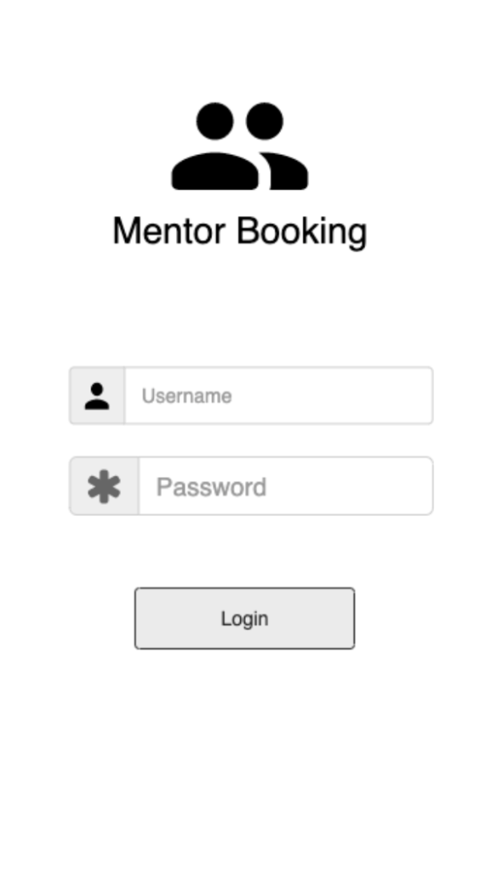
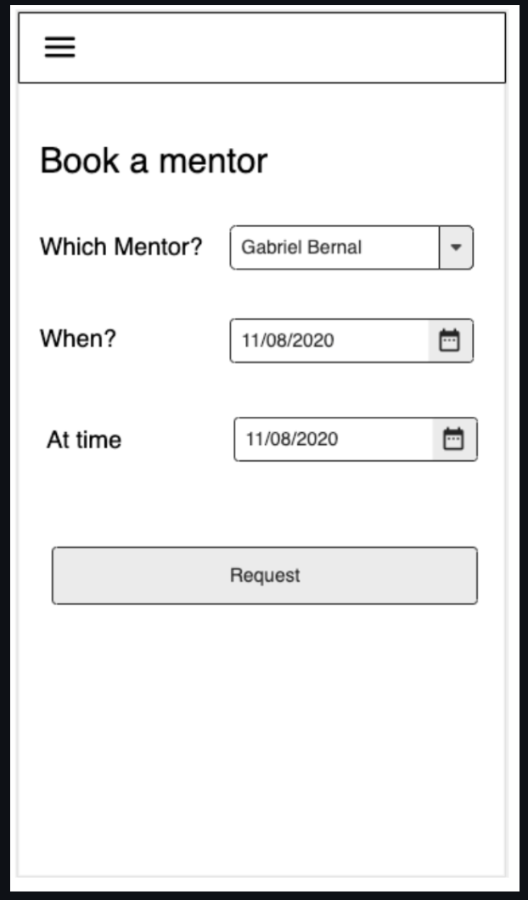
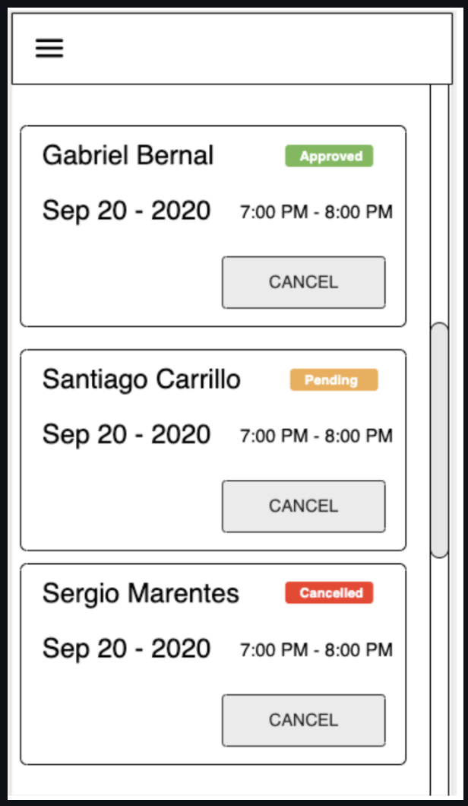

# Proyecto integrador Sprint 3

## ¿Cómo usar este proyecto?

1. instala [node](https://nodejs.org/en/download/), si aun no lo tienes
2. instala [yarn](https://classic.yarnpkg.com/en/docs/install), si aun no lo tienes

3. instala las dependencias

```
yarn install
```

4. Corre el servidor localmente

```
yarn start
```

5. Abre en tu navegador [http://localhost:3000](http://localhost:3000)

## Desarrollo del proyecto integrador

Utilizando lo que has aprendido acerca de componentes functionales de React y hooks (useState, useEffect).
Implementa los componentes necesarios para poder completear la interfaz de usuario (UI) de las siguientes tres páginas.

En la página de login hay un ejemplo del código que puedes usar para navegar entre páginas a partir de la acción de un usuario.

- Login Page

  

- Create Booking Page

  

- Booking List Page

  
